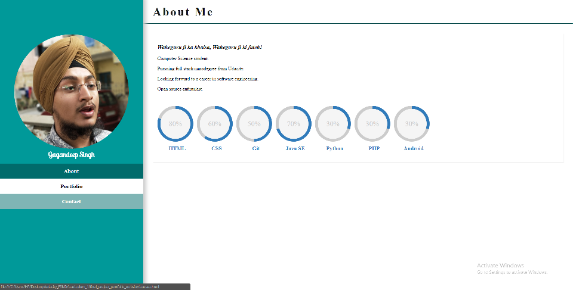
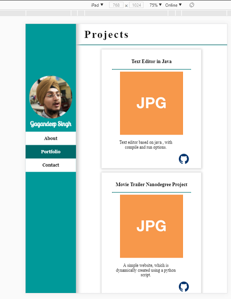
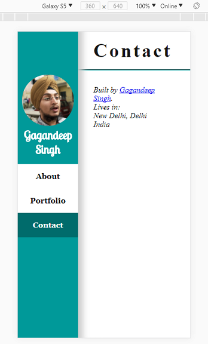

# Personal Portfolio Website
A simple website, which uses :

  - HTML5 features
  - Proper seperation of all types of files
  - Proper meta tags
  - Follows the rubric

## 3 Screeshot of 3 different screens to show responsiveness

