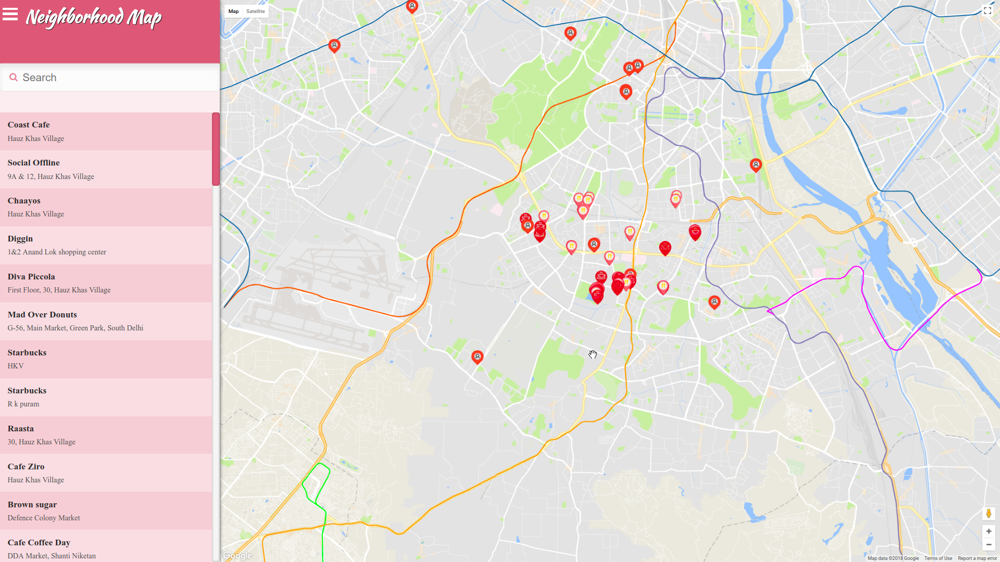

# Neighborhood Map

A single-page application featuring a map of my neighborhood. Map markers to identify popular locations or places one’d like to visit, a search function to easily discover these locations, and a listview to support simple browsing of all locations. Third-party APIs that provide additional information about each of these locations.

## Features

     1. Filter list character by character

     2. Filtering list will filter the markers on the map as well

     3. Data is loaded by 3 different AJAX calls through foursquare

## Resources and Frameworks

     1. Knockout.js: Organization framework to implement MVVM structure

     2. foursquare: API to obtain additional information about a location

     3. flaticon: For providing png for marker of different category

## Installation and Usage

     Simply clone this directory and fire up index.html in a local server.

## Screenshot

